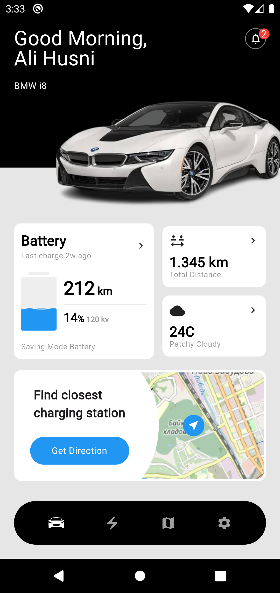
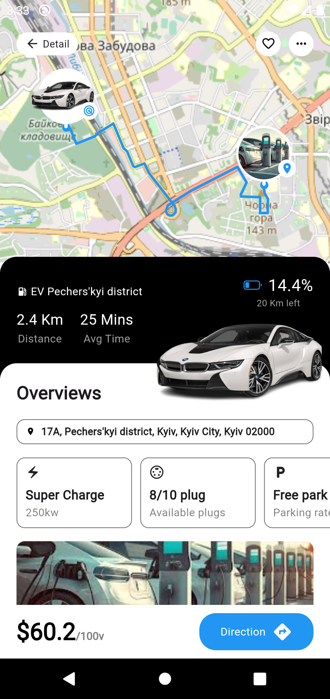

# charging_station_finder_app_ui

This project is a app that shows a map with Electric Charging Stations and their information. The app supports station markers clustering.
The app runs on Android, iOS and Web.
The app is built using Flutter 3.3 and Dart.
The app is built using the MVVM architecture.

## Preview

